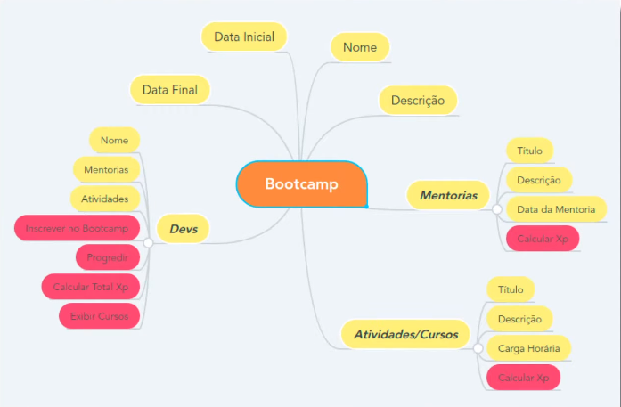

# Projeto Bootcamp

<h2> :scroll: Objetivos do projeto:</h2>

<p> "Desmistificar a Programação Orientada a Objetos (POO) com Java e praticar esse conceito fundamental nesse desafio. Para isso, os pilares da OO são devidamente formalizados: Abstração, Encapsulamento, Herança e Polimorfismo." </p>

----

<h2> :woman_technologist: O que foi desenvolvido:</h2>


----

## :newspaper_roll: Estrutura do Projeto: 

  ```
  
  ├── src
  |    ├── desafio
  |          ├── dominio
  │             ├── Bootcamp.java
  │             ├── Conteudo.java
  │             ├── Curso.java
  │             ├── Dev.java
  │             └── Mentoria.py      
  │   └── Main.java
  ├── README.md
  

```

---- 

<h2> :eyes: Para visualizar o projeto: </h2>

1. Clone o repositório

- Use o comando:  
    - ` git clone git@github.com:gab0403/projeto-bootcamp-dio.git`

- Entre na pasta do repositório que você acabou de clonar:
    - `cd projeto-bootcamp-dio`
